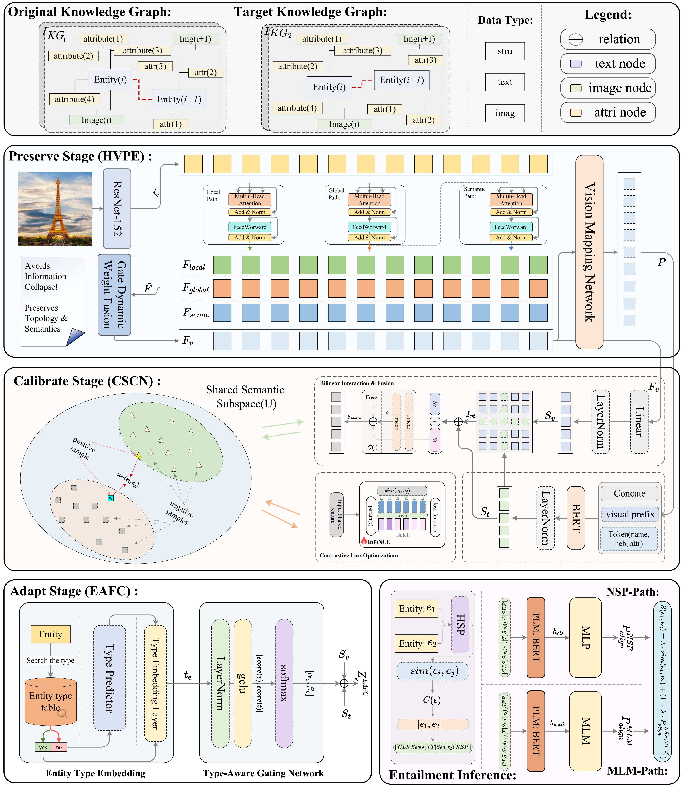

# HSP
We sincerely appreciate for the previous paper "[ME3A: A Multimodal Entity Entailment framework for multimodalEntity Alignment](https://github.com/OreOZhao/ME3A)", our work is based on its opened source. 

the code for HSP paper

## Model Architecture Diagram 模型架构图

## Baseline Model基线模型
- **PoE** establishes a foundational framework for cross-modal semantic fusion;
- **MMEA** unifies structure, attributes, and visual information for multimodal entity alignment;
- **EVA** employs vision as a pivot for unsupervised alignment;
- **MCLEA** advances multimodal contrastive learning to align heterogeneous embedding spaces;
- **MEAformer** formulates a meta-modality hybrid mechanism for heterogeneous modality fusion;
- **PCMEA** introduces pseudo-label calibration to alleviate noise propagation;
- **LoginMEA** presents a local-to-global interaction network for multi-level relational fusion;
- **OTMEA** aligns multimodal distributions via optimal transport to reduce heterogeneity;
- **GSIEA** separately models graph structure and multimodal information to mitigate structural heterogeneity;
- **RICEA** enhances generalization through relative interaction modeling and dynamic calibration;
- **CDMEA** addresses modality bias from a causal perspective;
- **ME³A** formulates MEA as an entity entailment task to enable fine-grained cross-graph interaction.

## Experimental Results实验结果

## Dataset数据集
*Cross-KG datasets:* The original cross-KG datasets (FB15K-DB15K/YAGO15K) comes from: [https://github.com/mniepert/mmkb]
*Bilingual datasets:* The multi-modal version of DBP15K dataset comes from the: [https://github.com/cambridgeltl/eva]
